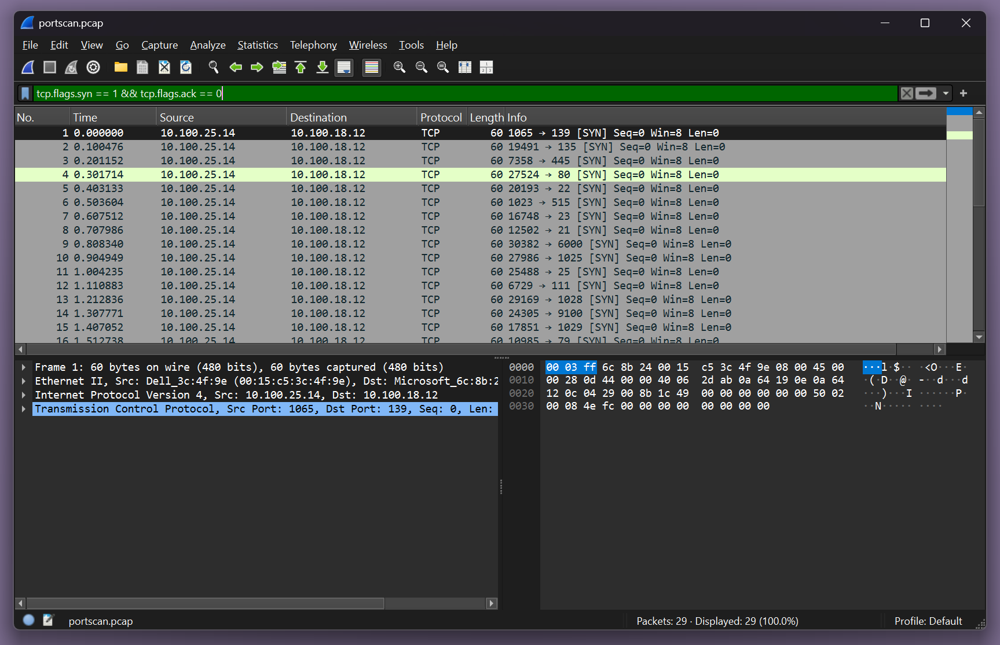
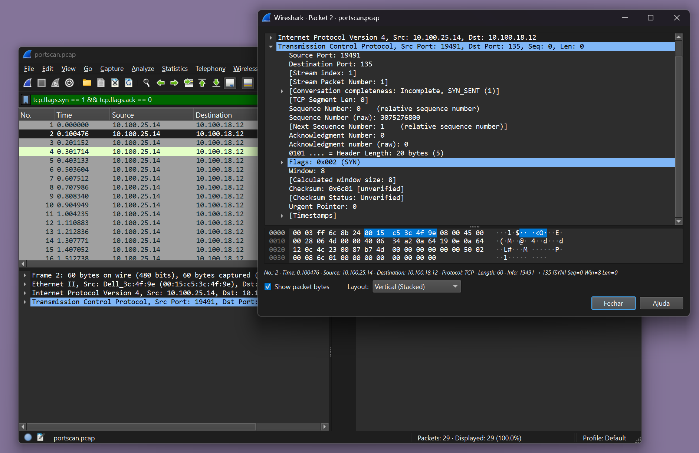
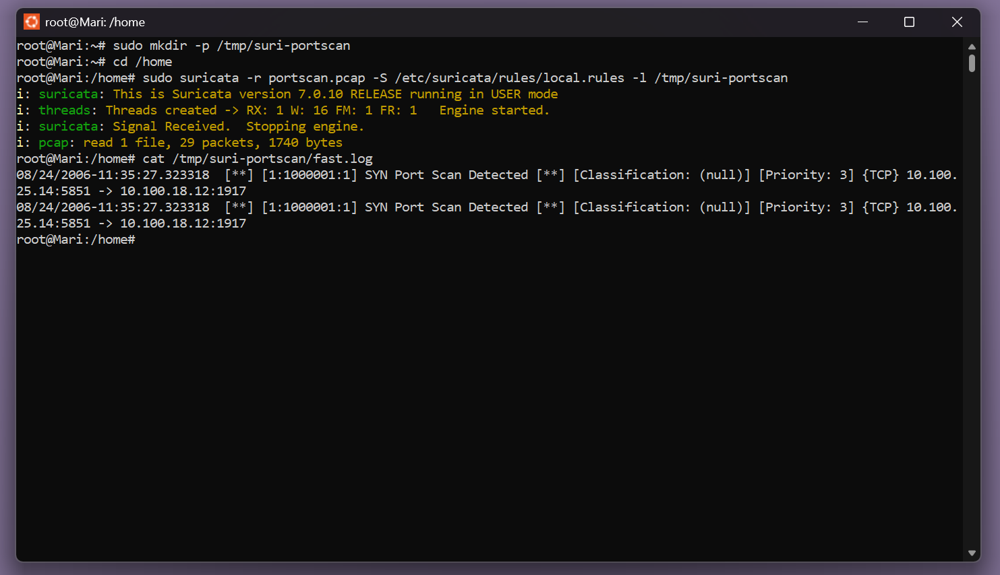

# 🚨 Detecção de Port Scan com Suricata

## 📦 port-scan-suricata/
```bash
├── images/                          <- Capturas de tela da análise
│   ├── 1-wireshark-syn-scan.png
│   ├── 2-wireshark-packet.png
│   └── 3-suricata-alert.png
├── pcap_files/                      <- Arquivos `.pcap` de exemplo
│   └── portscan.pcap
├── suricata_rules/                  <- Regras personalizadas do Suricata
│   └── local.rules
└── README.md                        <- Este arquivo
```

## 🧠 Objetivo
Detectar e analisar um ataque de **Port Scan** (varredura de portas) com **Suricata** e **Wireshark**. A ideia é identificar padrões de tráfego de rede típicos de ataques de port scan e gerar alertas automáticos com Suricata, além de validar a detecção manualmente com o Wireshark.

## 🔍 Contexto
Este projeto simula um **port scan** utilizando a ferramenta **Nmap** para gerar tráfego de rede, o qual é analisado com **Wireshark** e detectado automaticamente pelo **Suricata**. O objetivo é entender como essas ferramentas podem ser usadas para monitorar e identificar atividades suspeitas em uma rede.

---

## 📸 Evidências da Análise

### 🖼️ 1. Pacotes com flag `SYN` sem resposta (`SYN-ACK`)


- Diversos pacotes com a flag `SYN` ativada.
- Nenhuma resposta `SYN-ACK`, indicando que o objetivo era apenas sondar se as portas estavam abertas.
- Característico de um **SYN scan**, uma técnica de varredura discreta de portas.

---

### 🖼️ 2. Detalhe de um pacote `SYN`


- Flags: `SYN = 1`, `ACK = 0`
- Este pacote é uma tentativa inicial de conexão TCP.
- O pacote está sendo usado para sondar portas sem completar a conexão TCP.

---

### 🖼️ 3. Alerta do Suricata sobre o scan


- Alerta gerado pelo Suricata baseado em uma **regra personalizada**.
- O Suricata detecta o comportamento do ataque e gera um alerta, classificando a detecção como um **SYN Port Scan Detected**.
- A assinatura usada para detectar esse padrão foi configurada na **local.rules**.

---

## ✅ Conclusão

O comportamento de **Port Scan** foi detectado de duas maneiras:

1. **Manual**: Analisando os pacotes no Wireshark, conseguimos observar os pacotes `SYN` enviados de forma repetitiva sem que a conexão fosse completada.
   
2. **Automática**: O Suricata gerou um alerta com base na **regra personalizada** configurada na **local.rules**, detectando a atividade suspeita.

📌 Detectar um **port scan** é uma das primeiras ações que qualquer analista de SOC deve aprender. Isso pode permitir a **bloqueação de IPs maliciosos**, **geração de alertas** e ações preventivas antes de um ataque mais sério.

---

## 🧰 Ferramentas usadas
- 🕵️ **Wireshark** para capturar e analisar pacotes de rede  
- 🔥 **Suricata** (modo IDS) para gerar alertas de comportamento suspeito  
- 📁 Arquivo PCAP: `portscan.pcap` (arquivo de captura de tráfego)
